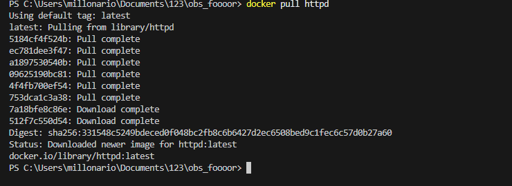

# Запуск веб-сервера Apache в Docker

## 1. Скачивание образа
Перед запуском контейнера необходимо скачать официальный образ Apache (httpd).  
Выполняем команду:
```bash
docker pull httpd


## 2. Запуск контейнера

Запускаем контейнер в фоновом режиме, пробрасывая порт 8080 хоста на порт 80 контейнера:
docker run -d -p 8080:80 --name my-apache-app httpd
Docker-pr/run.png

## 3. Проверка запущенных контейнеров

Убеждаемся, что контейнер работает:
docker ps
Docker-pr/ps.png

## 4. Проверка работы веб-сервера

Открываем браузер и переходим по адресу http://localhost:8080.
Видим стандартную страницу Apache:
Docker-pr/browser.png
